# Vendor Boos Micro-Sites.

### This vendor is the base structure for Boost Micro-Sites.

There are some components, styles, and utils that allows a faster implementation of the basics
features required on a Boost Micro-site.

Bellow a detailed description of their use.

# _Components_

## **_The Layout Component_**

This component is a page structure, it must be the first component into a NextPage.
Use it as a screen, that could contain navigation, body, footer, and a back-layer as background.

> **Layout  [empty]**

### code

```tsx
// pages/preview.tsx

// node_modules
import type { NextPage } from 'next';
// Vendor
import Layout from '../vendor/components/layout/Layout';

const PreviewPage: NextPage = () => <Layout title="Boost Juice" />;

export default PreviewPage;
```

### output


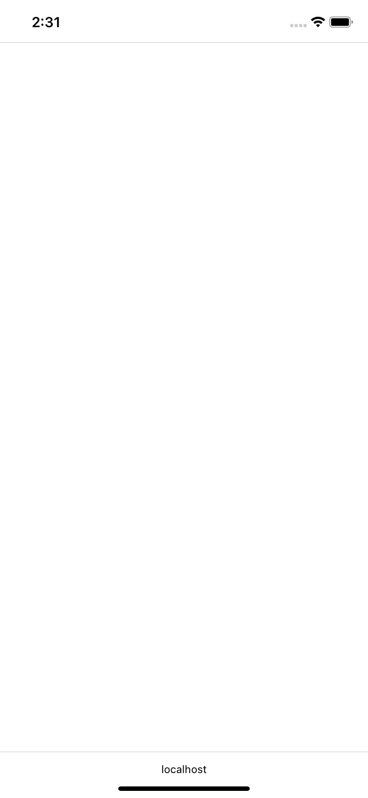

---

> **Layout Body**

### code

```tsx
// pages/preview.tsx

// node_modules
import type { NextPage } from 'next';
// Vendor
import Layout from '../vendor/components/layout/Layout';
import View from '../vendor/components/layout/View';
import { Colours } from '../src/styles/colours';

const PreviewPage: NextPage = () => (
  <Layout
    title="Home Page"
    backgroundColor={Colours.primary}
    textColor={Colours.dark}>
    <View className="vs-100 container">
      <h1>HELLO BOOST!</h1>
    </View>
  </Layout>
);

export default PreviewPage;
```

### output


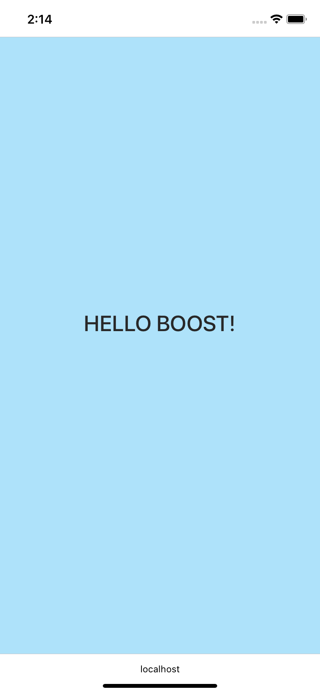

---

> **Layout Header**

### code

```tsx
// pages/preview.tsx

// node_modules
import type { NextPage } from 'next';
import Image from 'next/image';
// Vendor
import Layout from '../vendor/components/layout/Layout';
import View from '../vendor/components/layout/View';
import { getImagePath } from './files-helper';
import { Colours } from '../src/styles/colours';

const Header = () => (
  <View horizontal className="nav bg-dark navbar-dark container-fluid vh-7">
    <div className="navbar-brand">
      <Image
        src={getImagePath('boostLogo.svg')}
        alt="Boot Logo"
        width={103}
        height={38}
      />
    </div>
  </View>
);

const PreviewPage: NextPage = () => (
  <Layout
    title="Home Page"
    backgroundColor={Colours.primary}
    textColor={Colours.dark}
    header={Header}>
    <View className="vs-100 container">
      <h1>HELLO BOOST!</h1>
    </View>
  </Layout>
);

export default PreviewPage;

```

### output

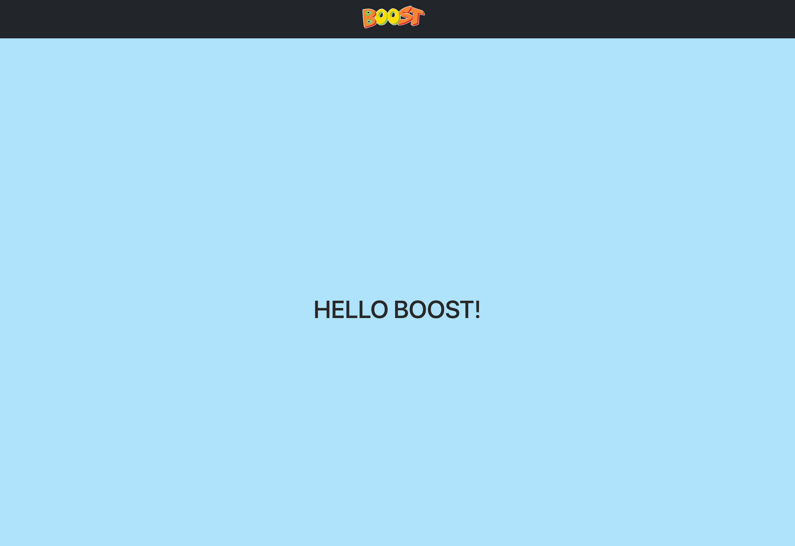
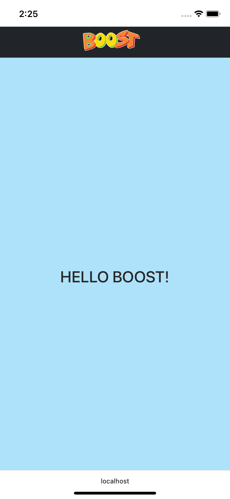

---

> **Layout Footer**

### code

```tsx
// pages/preview.tsx

// node_modules
import type { NextPage } from 'next';
import Image from 'next/image';
// Vendor
import Layout from '../vendor/components/layout/Layout';
import View from '../vendor/components/layout/View';
import { getImagePath } from '../vendor/utils/files-helper';
import { Colours } from '../src/styles/colours';

const Footer = () => (
  <View horizontal className="nav bg-dark navbar-dark container-fluid vh-7">
    <div className="navbar-brand">
      <Image
        src={getImagePath('boostLogo.svg')}
        alt="Boot Logo"
        width={103}
        height={38}
        className="d-inline-block align-text-top"
      />
    </div>
  </View>
);

const PreviewPage: NextPage = () => (
  <Layout
    title="Home Page"
    backgroundColor={Colours.primary}
    textColor={Colours.dark}
    footer={Footer}>
    <View horizontal className="vh-93 container">
      <h1>HELLO BOOST!</h1>
    </View>
  </Layout>
);

export default PreviewPage;


```

### output

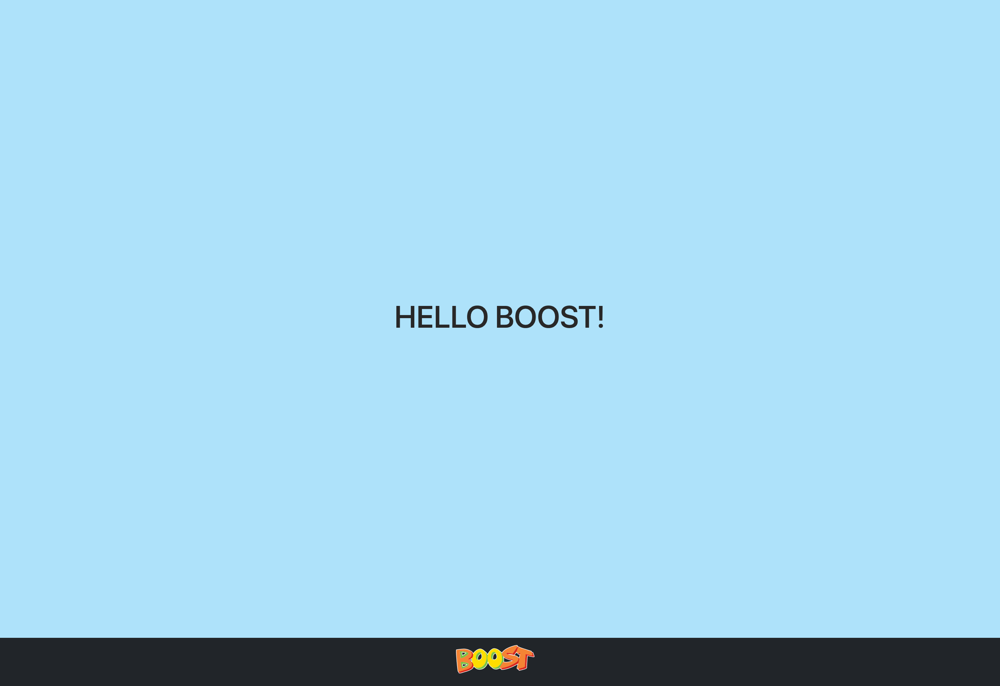
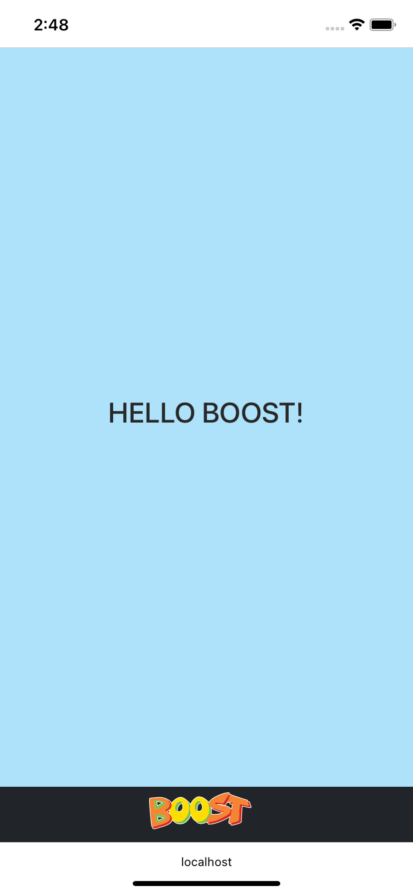

---

> **Layout Background**

### code

```tsx
// pages/preview.tsx

// node_modules
import type { NextPage } from 'next';
import Image from 'next/image';
// Vendor
import Layout from '../vendor/components/layout/Layout';
import View from '../vendor/components/layout/View';
import { Colours } from '../src/styles/colours';
import { getImagePath } from '../vendor/utils/files-helper';

const styles = {
  pattern: {
    backgroundColor: Colours.primary,
    opacity: 0.35,
    backgroundImage: `
    linear-gradient(30deg, #444cf7 12%, transparent 12.5%, transparent 87%, #444cf7 87.5%, #444cf7), 
    linear-gradient(150deg, #444cf7 12%, transparent 12.5%, transparent 87%, #444cf7 87.5%, #444cf7), 
    linear-gradient(30deg, #444cf7 12%, transparent 12.5%, transparent 87%, #444cf7 87.5%, #444cf7), 
    linear-gradient(150deg, #444cf7 12%, transparent 12.5%, transparent 87%, #444cf7 87.5%, #444cf7), 
    linear-gradient(60deg, #444cf777 25%, transparent 25.5%, transparent 75%, #444cf777 75%, #444cf777), 
    linear-gradient(60deg, #444cf777 25%, transparent 25.5%, transparent 75%, #444cf777 75%, #444cf777)
`,
    backgroundSize: '20px 35px',
    backgroundPosition: '0 0, 0 0, 10px 18px, 10px 18px, 0 0, 10px 18px',
  },
};

const Background = () => (
  <View fill stretch style={styles.pattern}>
    <Image
      src={getImagePath('boostLogo.svg')}
      alt="Boot Logo"
      width={103}
      height={38}
      className=""
    />
  </View>
);

const PreviewPage: NextPage = () => (
  <Layout
    title="Home Page"
    backgroundColor={Colours.primary}
    textColor={Colours.dark}
    background={Background}>
    <View className="vs-100 container pt-5">
      <h1>HELLO BOOST!</h1>
    </View>
  </Layout>
);

export default PreviewPage;

```

### output


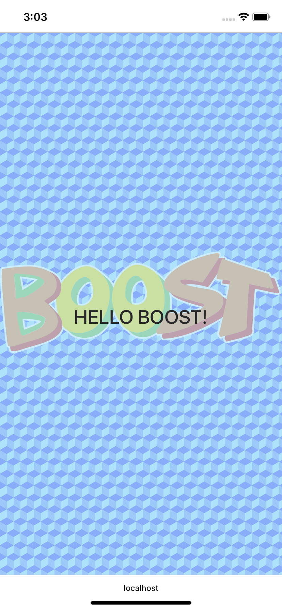

---

---

## **_The Animation Component_**

This component plays the role of a lottie
video player. <br/> [Airbnb-Lottie](https://airbnb.io/lottie)

> **Animation Setup**

    From Abode After Effects, exports an animation using the Lottie Plugin.
    This plugin generates two resources, a folder [images] that contains the 
    images used, and the animation itself in a json file [data.json].

    - Ensure both resourses, images folder and data.json are inside a common folder.

    Place the exported animation into the folder public/anim and set the folder name
    in a <Animation/> Component.

> Example

    Let's implement an animation with two version, one for mobile and one for desktop.
    both animations share the images, witch means a unique images folder and two json files
    they are:

    ./public/anim/fruits
    ├─── images
      ├─ img_0.png
      ├─ img_1.png
      ├─ img_2.png
      ├─ img_3.png
    ├─── data.desktop.json
    ├─── data.mobile.json

### code

```tsx
// pages/preview.tsx
// node_modules
import type { NextPage } from 'next';
// Vendor
import Layout from '../vendor/components/layout/Layout';
import View from '../vendor/components/layout/View';
import { Colours } from '../src/styles/colours';
import Animation from '../vendor/components/ui/animation/Animation';
//
const PreviewPage: NextPage = () => (
  <Layout
    title="Home Page"
    backgroundColor={Colours.primary}
    textColor={Colours.dark}>
    <View className="vs-100">
      <Animation folder="fruits" responsive />
    </View>
  </Layout>
);
export default PreviewPage;
```

### output

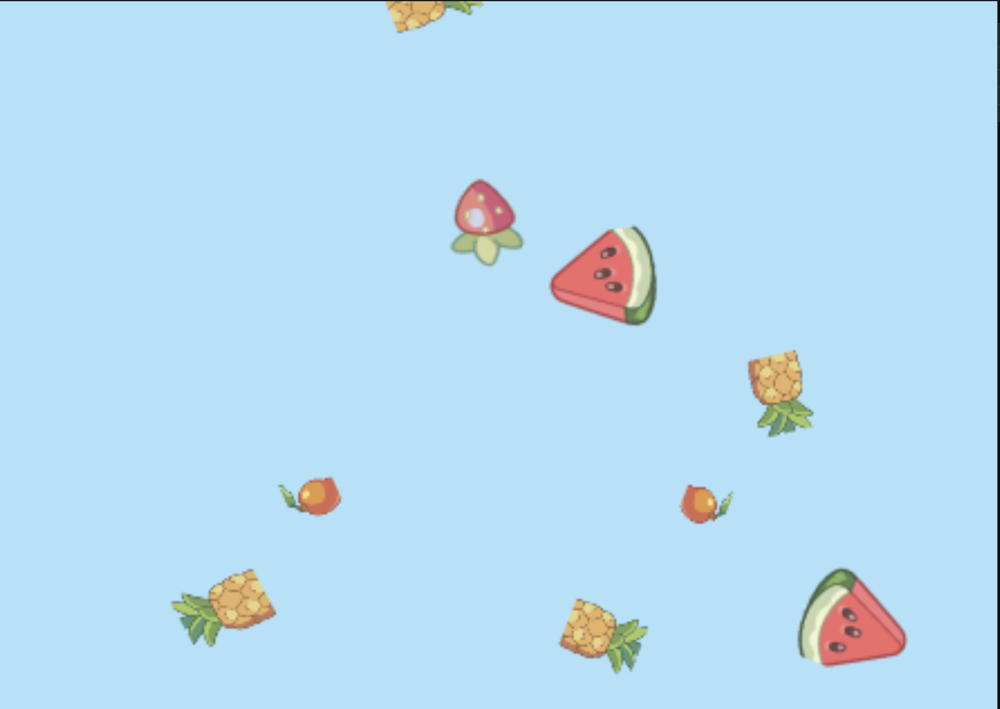
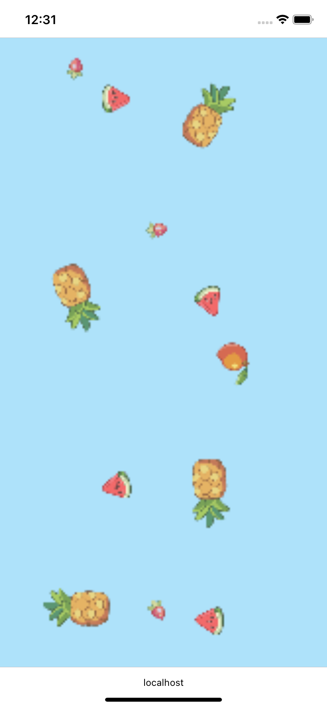

---

## **_The View Component_**

This component is a container that helps to positioning its content.

> **View: Center**

### code

```tsx
// pages/preview.tsx

// node_modules
import type { NextPage } from 'next';
// Vendor
import Layout from '../vendor/components/layout/Layout';
import View from '../vendor/components/layout/View';
import { Colours } from '../src/styles/colours';

const PreviewPage: NextPage = () => (
  <Layout
    title="Home Page"
    backgroundColor={Colours.primary}
    textColor={Colours.dark}>
    <View className="vs-100 p-2">
      <View className="card p-2">
        <h1>Boost Juice</h1>
      </View>
    </View>
  </Layout>
);
export default PreviewPage;
```

### output

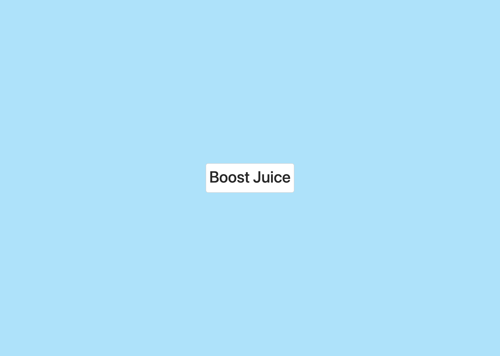
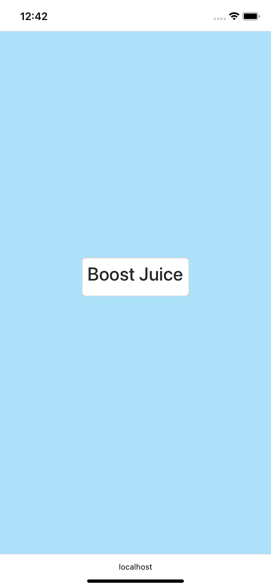

---

> **View: horizontal**

### code

```tsx
// same code, except.

//...
<View horizontal className="card p-2">
  <h1>Boost Juice</h1>
</View>
//...
```

### output

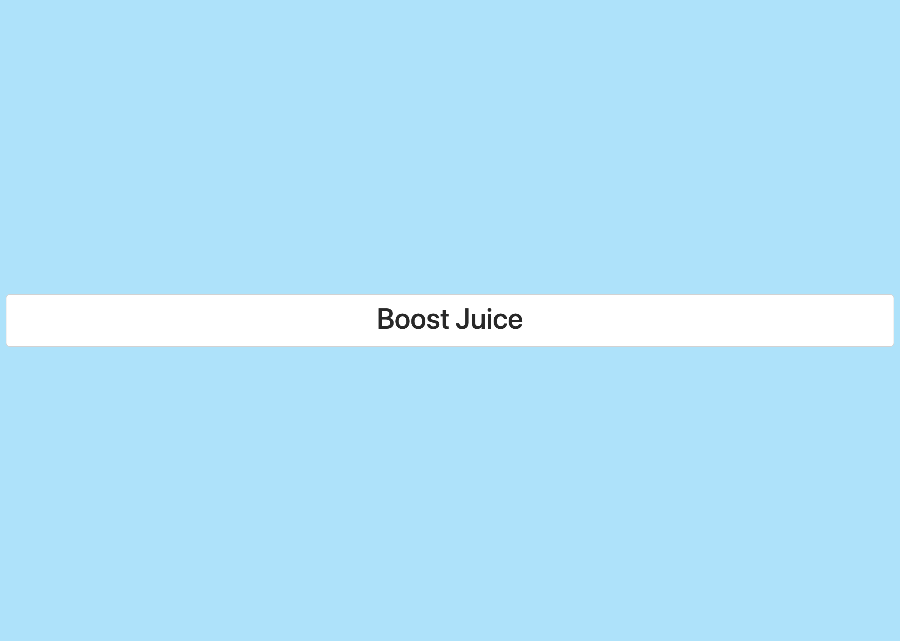
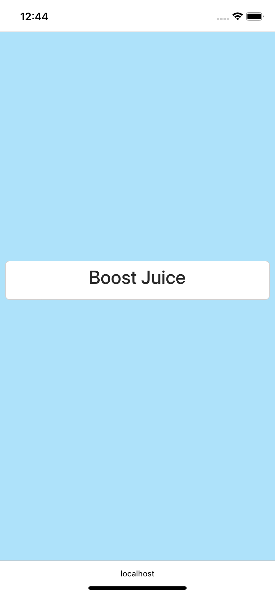

---

> **View: vertical**

### code

```tsx
// same code, except.

//...
<View vertical className="card p-2">
  <h1>Boost Juice</h1>
</View>
//...
```

### output

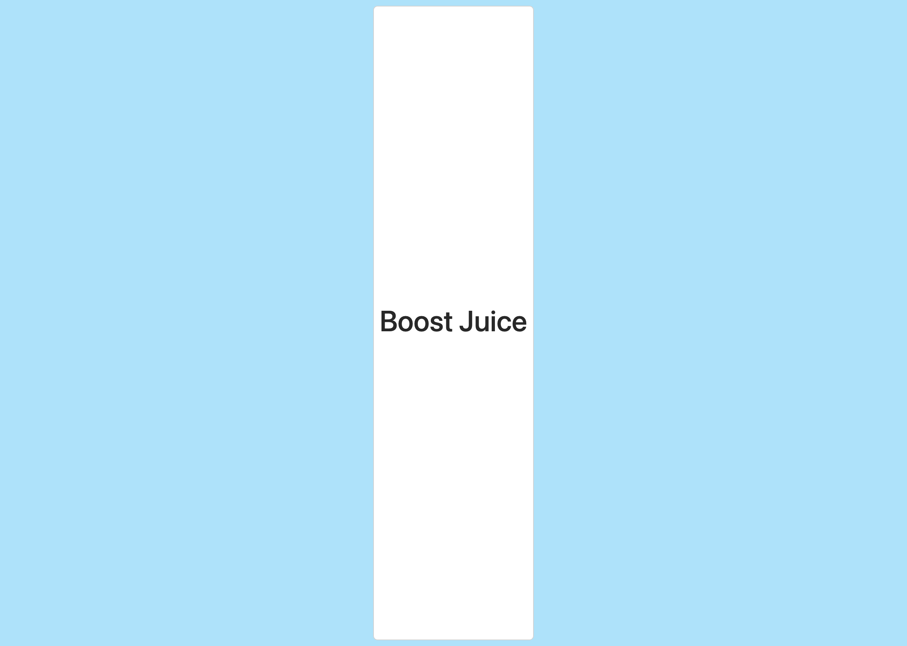
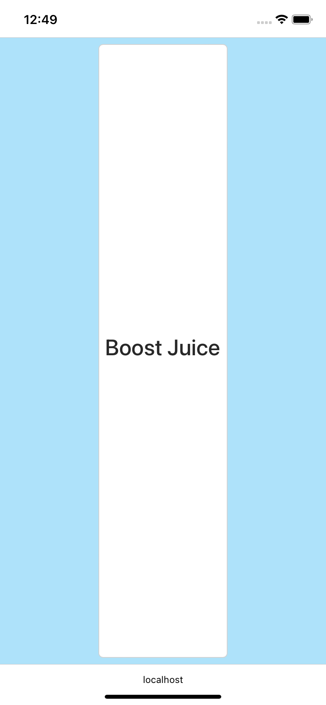

---

> **View: fill**

### code

```tsx
// same code, except.

//...
<View fill className="card p-2">
  <h1>Boost Juice</h1>
</View>
//...
```

### output

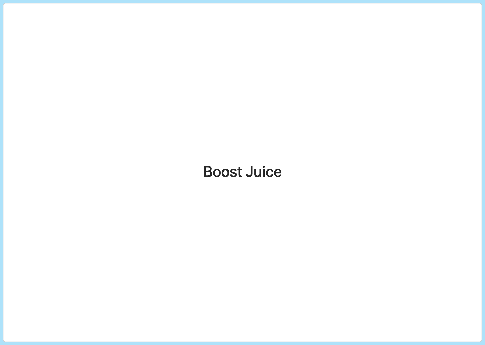
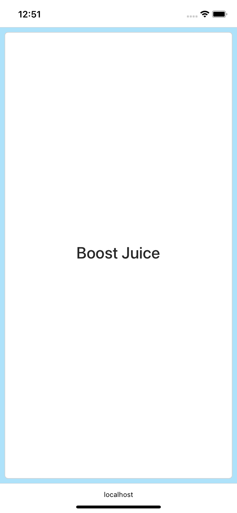

---

> **View: Orientation Column**

by default:

### code

```tsx
// pages/preview.tsx

// node_modules
import type { NextPage } from 'next';
// Vendor
import Layout from '../vendor/components/layout/Layout';
import View from '../vendor/components/layout/View';
import { Colours } from '../src/styles/colours';

const PreviewPage: NextPage = () => (
  <Layout
    title="Home Page"
    backgroundColor={Colours.primary}
    textColor={Colours.dark}>
    <View className="vs-100 p-2">
      <View fill className="card p-2">
        <h1>Boost Juice</h1>
      </View>
      <View fill className="card p-2">
        <h1>Boost Juice</h1>
      </View>
      <View fill className="card p-2">
        <h1>Boost Juice</h1>
      </View>
      <View fill className="card p-2">
        <h1>Boost Juice</h1>
      </View>
    </View>
  </Layout>
);
export default PreviewPage;

```

### output

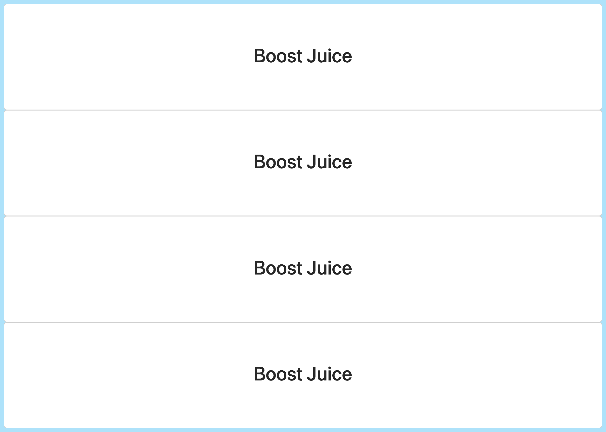
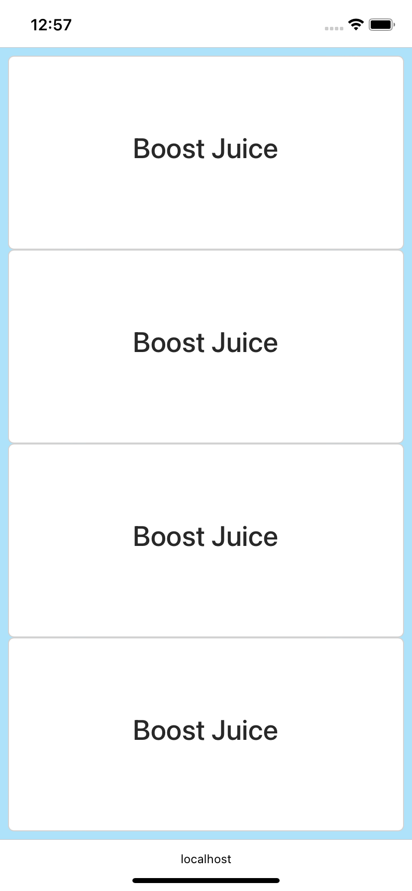

---

> **View: Orientation Column**

by default:

### code

```tsx
// same code, except.

// ...
<View row className="vs-100 p-2">
  (...)
</View>
// ...
```

### output


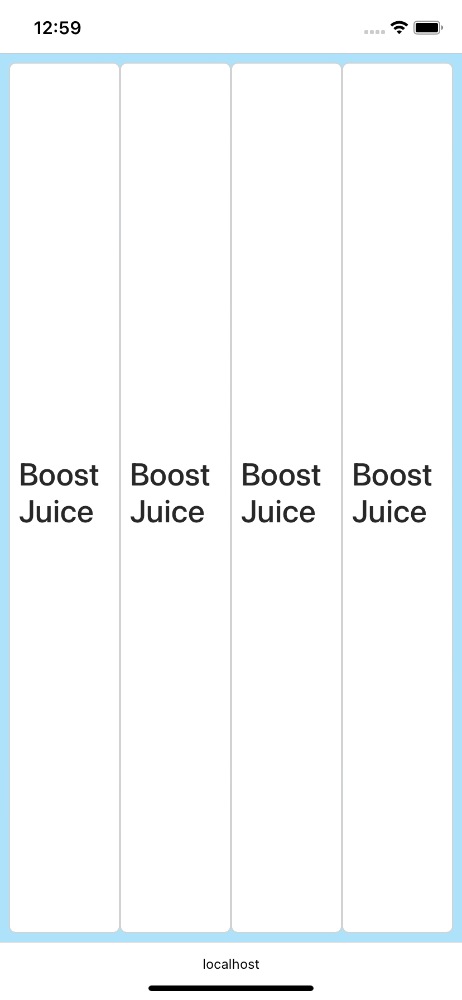

---

> **View: Content Position**

    (by default) = center
    
    left = center left
    right = center right

    top left = left top
    top = center top
    top rigth = right top

    bottom left  = left bottom
    bottom = center bottom
    bottom right = right bottom

### code

```tsx
// pages/preview.tsx

// node_modules
import type { NextPage } from 'next';
// Vendor
import Layout from '../vendor/components/layout/Layout';
import View from '../vendor/components/layout/View';
import { Colours } from '../src/styles/colours';

const PreviewPage: NextPage = () => (
  <Layout
    title="Home Page"
    backgroundColor={Colours.primary}
    textColor={Colours.dark}>
    <View stretch className="vs-100 p-2">
      <View stretch row>
        <View left top className="card p-2">
          <span>Boost Juice</span>
        </View>
        <View top className="card p-2">
          <span>Boost Juice</span>
        </View>
        <View top right className="card p-2">
          <span>Boost Juice</span>
        </View>
      </View>

      <View stretch row>
        <View left className="card p-2">
          <span>Boost Juice</span>
        </View>
        <View className="card p-2">
          <span>Boost Juice</span>
        </View>
        <View right className="card p-2">
          <span>Boost Juice</span>
        </View>
      </View>

      <View stretch row>
        <View left bottom className="card p-2">
          <span>Boost Juice</span>
        </View>
        <View bottom className="card p-2">
          <span>Boost Juice</span>
        </View>
        <View right bottom className="card p-2">
          <span>Boost Juice</span>
        </View>
      </View>
    </View>
  </Layout>
);
export default PreviewPage;

```

### output

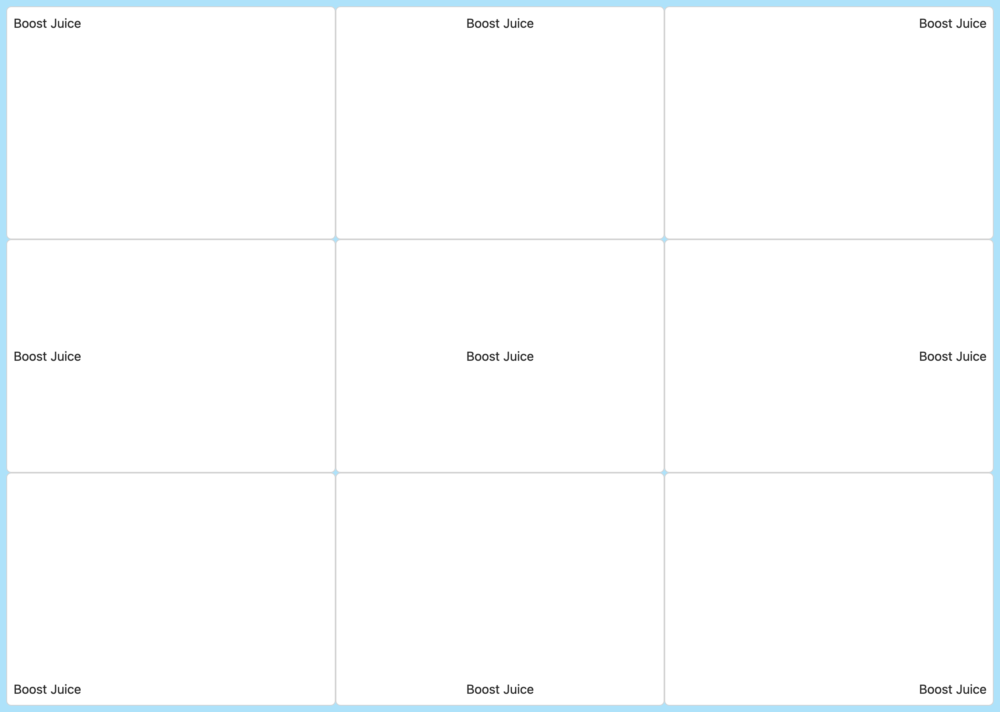
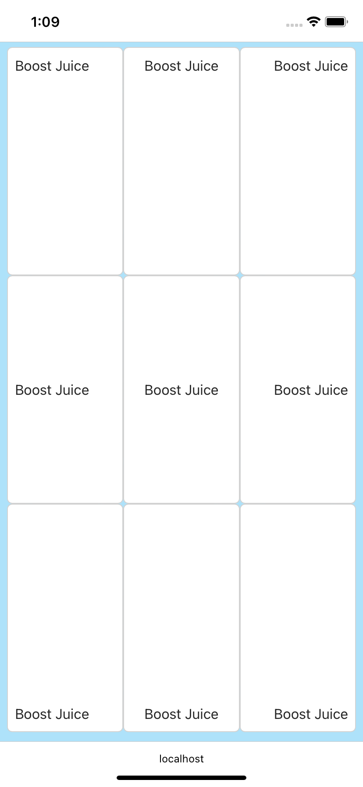

---
